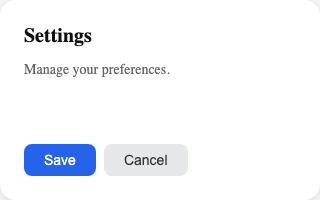
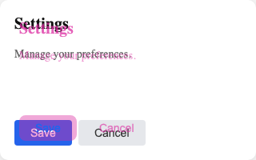

# design-ruler

给 AI agent 的一把尺——测量运行时渲染、截图、生成重影对比图来验证 CSS 还原度。

大多数设计转代码工具都想变聪明：做像素 diff、打相似度分、生成报告。design-ruler 走相反的路——**只采集数据，然后闪开**。AI agent 读取测量值，自己跟手里的设计规格对比，修 CSS，再量一次验证。不需要人介入。

这是从一套内部 MCP 设计验证管线中提炼出来的开源 CLI。

## 为什么需要

AI coding agent 已经能读设计规格、能写 CSS。它们做不到的是**看到**渲染结果。它们没法知道 `border-radius: 12px` 是否真的渲染成了 12px，或者 `gap: 16px` 是不是把所有东西偏移了 8px。

design-ruler 给 agent 装上眼睛：

```
Agent 读设计规格  →  "弹框应该是 400×300，圆角 12px，内边距 24px"
Agent 写 CSS     →  修改样式
Agent 跑 measure →  拿到运行时真实值（JSON）
Agent 对比       →  "宽度 380 不是 400，内边距 16 不是 24"
Agent 修复       →  调整 CSS
Agent 再量一次   →  "所有偏差 < 1px ✓"
```

不需要 SSIM 分数，不需要像素热力图，不需要 HTML 报告。Agent 本身就是 diff 引擎。

## 安装

需要 Node.js >= 18。

```bash
# 从源码安装
git clone https://github.com/Fzhiyu1/design-ruler.git
cd design-ruler
pnpm install
pnpm build
npm link

# 安装 Playwright 浏览器（首次需要）
npx playwright install chromium
```

验证：

```bash
design-ruler --version
```

## 命令

### measure

读取元素的包围盒、计算样式和子元素布局，输出结构化 JSON。

```bash
design-ruler measure --url "http://localhost:3000" --selector ".dialog"
```

```json
{
  "selector": ".dialog",
  "bbox": { "x": 100, "y": 200, "width": 400, "height": 300 },
  "computedStyle": {
    "border-radius": "12px",
    "padding": "24px",
    "font-size": "16px",
    "background-color": "rgb(255, 255, 255)"
  },
  "children": [
    {
      "tag": "h2",
      "className": "title",
      "bbox": { "x": 24, "y": 24, "width": 352, "height": 28 },
      "text": "Settings",
      "children": []
    }
  ]
}
```

用 `--depth` 控制遍历深度：

```bash
# 只量元素本身，不采子元素
design-ruler measure --url "..." --selector ".dialog" --depth 0

# 3 层深（元素 → 子 → 孙 → 曾孙）
design-ruler measure --url "..." --selector ".dialog" --depth 3
```

子元素的 `bbox` 坐标是相对父元素的，可以直接和设计稿布局对比。

### screenshot

截取页面或特定元素的 PNG 截图。

```bash
# 整页
design-ruler screenshot --url "http://localhost:3000" --output page.png

# 特定元素
design-ruler screenshot --url "http://localhost:3000" --selector ".dialog" --output dialog.png

# 完整可滚动页面
design-ruler screenshot --url "http://localhost:3000" --full-page --output full.png
```

输出：`{ "output": "page.png", "bytes": 45678 }`

### overlay

生成重影图：设计截图（品红染色）叠在实时渲染上。

```bash
# 组件级（推荐）：Sharp 像素级合成
design-ruler overlay --design dialog.png --url "http://localhost:3000" --selector ".dialog" --output ghost.png

# 全页：直传偏移参数
design-ruler overlay --design spec.png --url "http://localhost:3000" --offset-x 0 --offset-y 0 --output ghost.png

# 交互模式：打开浏览器 UI 手动对齐
design-ruler overlay --design ./design.png --url "http://localhost:3000"
```

设计元素显示为**品红色**，实现保持原色。对齐处看起来正常，偏移处出现品红重影：

| 设计稿 | 重影对比图 |
|--------|-----------|
|  |  |

重影效果会放大 1-2px 的偏移。AI agent 读取重影图就能直接定位哪些元素偏了、偏了多少。

**染色原理：** 设计图经过 Sharp 预处理——白色/浅色像素变透明，深色/有色像素染成品红，透明度与像素深度成正比。这样背景不会被污染，AI 可以始终区分设计重影（品红）和实际渲染（原色）。

## 引擎

支持两种浏览器引擎：

| 引擎 | 适用场景 | 参数 |
|------|---------|------|
| **Playwright**（默认） | 本地开发、CI、任何网页 | 无需额外参数 |
| **CDP** | Android WebView、嵌入式浏览器、远程调试 | `--cdp host:port` |

Playwright 自动启动无头 Chromium。CDP 通过 Chrome DevTools Protocol 连接已运行的浏览器。

```bash
# CDP 示例：Android 模拟器 WebView
adb forward tcp:9222 localabstract:webview_devtools_remote_$(adb shell pidof com.example.app)
design-ruler measure --url "http://localhost:3000" --selector ".box" --cdp 127.0.0.1:9222
```

## 设计源无关

design-ruler 不连接任何设计工具。它只测量运行时这一侧。设计规格在 agent 已有的任何地方：

- **Figma** — 通过官方 MCP、REST API 或手动导出
- **Sketch、Penpot、Pixso** — 导出截图，用 overlay
- **Design tokens** — agent 已经知道值了
- **餐巾纸草图** — 拍张照，overlay 上去

Agent 负责桥接设计数据和运行时测量值。design-ruler 只负责提供测量值。

## Agent 工作流

三个命令协同工作，形成验证闭环。`measure` 是真理源——给出精确数值。`screenshot` 和 `overlay` 是视觉辅助，帮 agent **发现**问题，但 `measure` 才是**确认**修复的最终裁判。

```
1. 读设计规格（从 Figma MCP、设计文档或图片）
2. 写/改 CSS
3. 发现问题（视觉）：
   - design-ruler screenshot → agent 读截图，和设计稿对比
   - design-ruler overlay --selector ".component" → agent 读重影图，定位偏移区域
4. 量化问题（结构）：
   - design-ruler measure → 拿到精确渲染值（JSON）
   - 对比设计规格 vs 实际 → 找出偏差 > 2px 的属性
5. 修 CSS
6. 验证（measure 为最终裁判）：
   - design-ruler measure → 所有偏差 < 2px？完成。
   - 否则回到第 3 步。
```

**为什么 measure 主导：** 重影图和截图依赖多模态视觉，有精度限制——AI 可能漏掉 2px 偏移或误判颜色。`measure` 返回精确计算值（`border-radius: 12px`，`padding: 24px`），可以零歧义地程序化对比。

**为什么视觉仍然重要：** `measure` 看不到所有东西。阴影、渐变、视觉重量、图标对齐、整体"感觉"——这些需要眼睛。agent 用 `screenshot` 检查整体视觉保真度，用 `overlay` 重影图快速定位空间偏移。然后 `measure` 确认和量化。

## 编程 API

```typescript
import { createEngine, PlaywrightEngine } from 'design-ruler'
import { writeFile } from 'fs/promises'

// 自动选择引擎
const engine = await createEngine({ url: 'http://localhost:3000' })

// 或显式指定
const engine = await PlaywrightEngine.create('http://localhost:3000', {
  viewport: { width: 1920, height: 1080 },
})

const result = await engine.measure('.dialog', 2)
console.log(result.bbox, result.computedStyle)

const buf = await engine.screenshot({ selector: '.dialog' })
await writeFile('dialog.png', buf)

await engine.close()
```

## 背景

这个工具从一套内部设计验证管线（Vue 3 + Android WebView + Figma MCP）中提取。完整管线包含双侧布局快照、SSIM 评分和 HTML 报告生成。

实践中我们发现，**AI agent 不需要这些重型机制中的大部分**。给它们结构化的测量数据，它们自己就能搞定。那些重型验证工具（SSIM、报告、带容差的 CSS diff）反而打断了 agent 的自主流程——AI 要停下来解析报告，再决定下一步。用 design-ruler，AI 直接读 JSON 然后行动。

最好的工作流是：**人选中一个设计模块，agent 搞定其余一切。**

design-ruler 是这个教训的开源提炼：**工具应该采集数据，而不是做决策。**

## License

MIT
